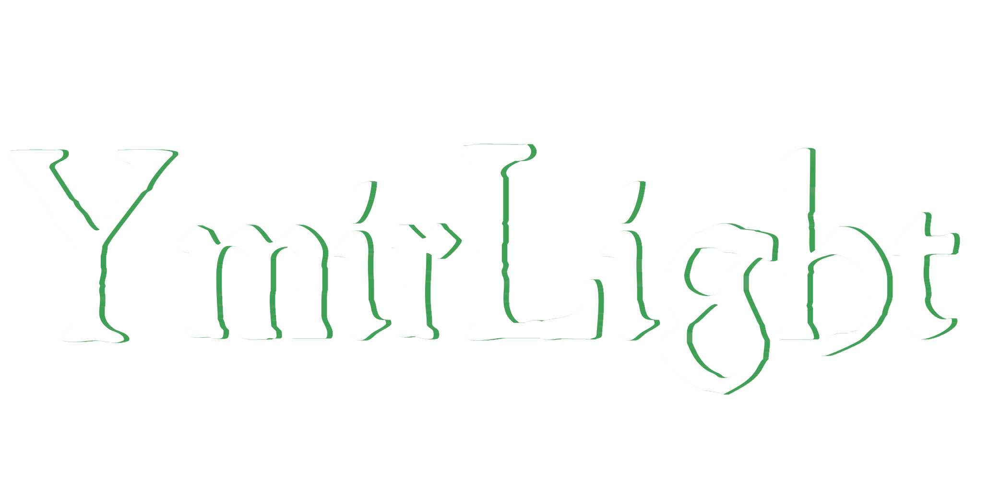

  

[Discord](https://discord.gg/ru664Z69UC/)

# YMIRLIGHT  
Space-Station 14

YmirLight is an open source project aimed at creating unique mechanics and a pleasant game atmosphere in the game Space Station 14, 

a game about survival on a space station where there are constant confrontations between the crew and antagonists created to prevent the crew from achieving their goals.

## Space-Station 14 Documentation/Wiki

Space-Station 14 has [docs site](https://docs.spacestation14.io/) documentation on SS14s content, engine, game design and more. We also have lots of resources for new contributors to the project.

## Project Activity

---

## License

> [!CAUTION]
> The repository code is licensed both under MIT - this applies to Space Wizards Federation code - and under modified MIT - this applies to starlight's changes.
> YmirLight's changes are gonna be the FreeBSD license (SPDX:	BSD-2-Clause)

### Click each banner for further information

---

>Some files are licensed under [MIT license](https://opensource.org/license/MIT), these files are Space Wizards Federation code.

>All other non-code STARLIGHT and YmirLight Assets, including icons and sound files, are licensed under the [Creative Commons 3.0 BY-SA](https://creativecommons.org/licenses/by-sa/3.0/) license unless otherwise noted in the folder or file.

